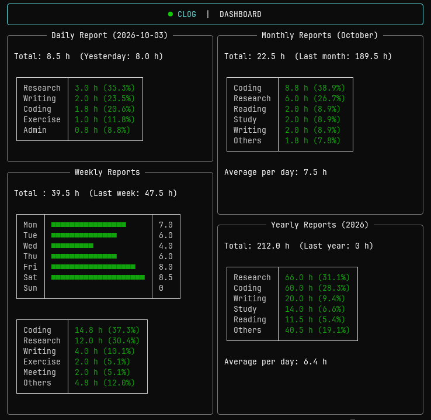

# clog
CLI working time tracker.<br>
Visualize your effort.<br>
Expose your laziness.<br>
Statistics never lie.

## Dependencies
- Python >= 3.10
- [rich](https://github.com/textualize/rich)

## Installation
Clone this repo and run `pip install .`.

```sh
$ git clone https://github.com/ryota0527/clog.git .
$ cd clog
$ pip install .
```

Uninstall:
```sh
$ pip uninstall clog
```

## Usage
Initialize:
```sh
$ clog init
```

Register some categories of your work, e.g.
```sh
$ clog create reading
$ clog create research
$ clog create meeting
```

To see the categories you registered, run:
```sh
$ clog list
```

Make sure to start tracking when you start working:
```sh
$ clog start <category>
```

When you finished, stop tracking:
```sh
$ clog stop
```

If you forgot to start tracking, you are still able to add working time manually:
```sh
$ clog add <category> <working time>
```
(working time argument must be integer or float. float will be rounded to one decimal place.)

To check the statistics of your working time, run:
```sh
$ clog show
```
Example:<br>


Note: Dashboard may not be displayed correctly in the small window. width > 100 is recommended.
